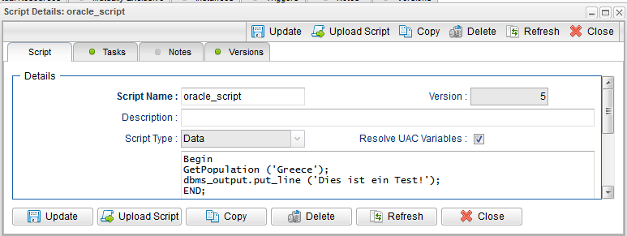
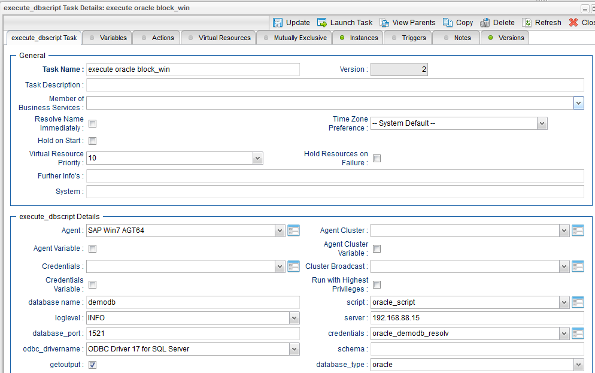

# ut-sqlserver-exec-dbscript-for-oracle-sqlserver-windows
The Universal Task allows to execute an oracle PLSQL block or an SQLServer T-sql statement. It uses an agentless connection via ODBC
towards SQLServer and the oracle basic instant client to connect to an Oracle database.

# Abstract: 

This Universal Task allows to execute an oracle PLSQL block or an SQLSERVER T-sql statement. It uses an agentless connection via ODBC
towards SQLSERVER and the oracle basic instant client to connect to an Oracle database.

# 1	Disclaimer

No support and no warranty are provided by Stonebranch GmbH for this document and the related Universal Task. The use of this document and
the related Universal Task is on your own risk.
Before using this task in a production system, please perform extensive testing.
Stonebranch GmbH assumes no liability for damage caused by the performance of the Universal Tasks

# 2	Introduction

The here described Universal Task allows to execute an oracle PLSQL block or an SQLSERVER T-sql statement. It uses an agentless connection 
via ODBC towards SQLSERVER and the oracle basic instant client to connect to an Oracle database. The connection and execution of the sql 
statements is performed using the python cx_oracle and pyodbc modules. 
Some details about the universal task to monitor a value in a database column

- The Universal Task supports SQLSERVER & Oracle
- MySql and PostgreSQL can be added in the future
- The Universal Task supports both Universal Agent for Linux/Unix and Windows (Note: This Universal Task has been tested only on Windows Universal Agent)
- You can select different log-levels e.g. Info and debug
- You can execute oracle PLSQL blocks and SQLSERVER T-SQL statements
-	You can decide if the sql-output is provided in the standard out or not
- All Passwords are encrypted using Controller Credentials

# 3	Installation
# 3.1	Software Requirements for Windows Agent

**Universal Template name: ut-sqlserver-exec-dbscript-for-orcale-sqlserver-windows**

Related UAC XML Files for template and task: [1]

Requirements to remotely connect from a Windows agent to an Oracle and/or SQLSERVER: 
-	Python 3.7.0-amd64 installed on a windows server where a Universal Agent is installed. 
-	For Python the following modules are required: 
      -	sys, for output re-direct processing
      -	datetime, date and time stamps for messages
      -	pyodbc to perform the ODBC connection
      -	cx_Oracle – Oracle DB support
      -	logging, for python loglevel support
-	Universal Controller V6.4.7.0 or higher
-	Universal Agent V6.4.2.2 or higher installed on a Windows Server
-	Microsoft ODBC driver V17 installed on the Windows SQLSERVER
-	The Windows Server needs to have Visual Studio VS 2013 installed.
-	The Windows Server needs to have oracle instant client Version 18.3.0.0.0 installed. 

# 3.2	Installation Steps

The following describes the installation steps:

**1. Install Python 3.7.0/64bit (python-3.7.0-amd64)  for Windows on any Windows Server running a Universal Agent.**
      Official Download link: https://www.python.org/downloads/
      Important Note: 
      
      Install python with the options: 
      
            - add python to windows path    
            - Install for all users
            
**2.	Add the required python modules**

In a dos command shell run as Administrator:

- pip install pyodbc1
- pip install cx_oracle
- pip install datetime
- pip install logging

Note: The module pyodbc contain the commands to perform SQL commands via an ODBC connection a SQLSERVER database. 
The module cx_oracle contain the commands to perform PLSQL commands via the oracle basic Instant Client to an oracle database. 

It is assumed that the modules logging, sys, datetime are already available. If not install them via pip.

**3.	Install the Microsoft ODBC driver V17 installed on the Windows SQLSERVER**

https://docs.microsoft.com/de-de/sql/connect/odbc/download-odbc-driver-for-sql-server?view=sql-server-2017 

**4.	Install Visual Studio VS 2013 on the windows server**

https://support.microsoft.com/en-us/help/3179560/update-for-visual-c-2013-and-visual-c-redistributable-package 

**5.	Install the oracle instant client Version 18.3.0.0.0**

http://www.oracle.com/technetwork/topics/winx64soft-089540.html

**Installation of oracle instant client:**

**a.	Download the Instant Client packages oracle instant client Version 18.3.0.0.0 for windows.**

http://www.oracle.com/technetwork/topics/winx64soft-089540.html 

**b.	Unzip the packages into a single directory such as:** 

C:\oracle\instantclient_18_3

**c.	Add this directory to the PATH environment variable. If you have multiple versions of Oracle libraries installed, make sure the new directory occurs first in the path**

**d.	Download and install Microsoft Visual Studio 2013 redistributable**

https://support.microsoft.com/en-us/help/2977003/the-latest-supported-visual-c-downloads#bookmark-vs2013

**6.	Import the Universal Task including the Universal Template to your Controller**

Go to “All Tasks” and load via the Import functionality the Universal Task configuration into the Controller. 

Image1:

Image2:

# 4	Universal Task Configuration

**1.	Activate: Resolvable Credentials in Universal Automation Center properties:**

Image3

**2.	Fill Out the Universal Task for SQL script to be scheduled:**

**Oracle example:**

The following PLSQL block should be scheduled:

Begin
GetPopulation ('Greece');
dbms_output.put_line ('Dies ist ein Test!');
END;

a)	Fill out the script to be called
Note: in the script you can use Controller Variables.

Image4

b)	Fill out the Universal Task and assign the script to it

Image5

Credential for Universal Task:

Image6

**Task Output:**

Because the getouput field is checked, the STDOUT contains the dbms_output of the stored procedure.

Image7

**SQLSERVER example**

The following T-SQL block should be scheduled:

EXEC dbo.listtask_all;

a)	Fill out the script to be called
Note: in the script you can use Controller Variables.

Image8

b)	Fill out the Universal Task and assign the script to it

Image9

**Credential for Universal Task:**

Image10

**Task Output:**
Because the getouput field is checked, the STDOUT contains the dbms_output of the stored procedure

Image11

**Description:**

Image12

# 5	Test Cases
The following basic test cases has been performed

Image13

# 6	Document References
This document references the following documents:

Image14

